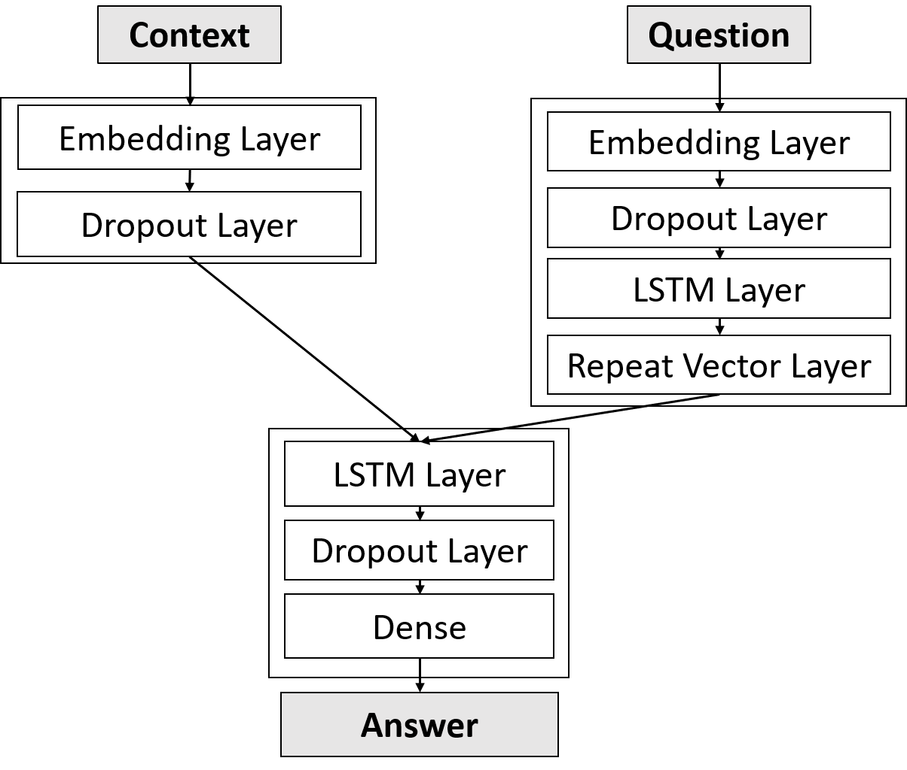
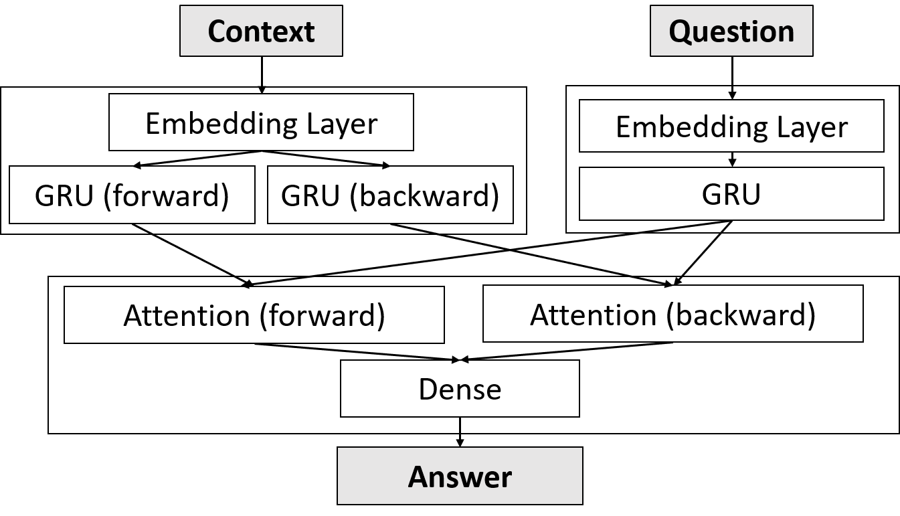
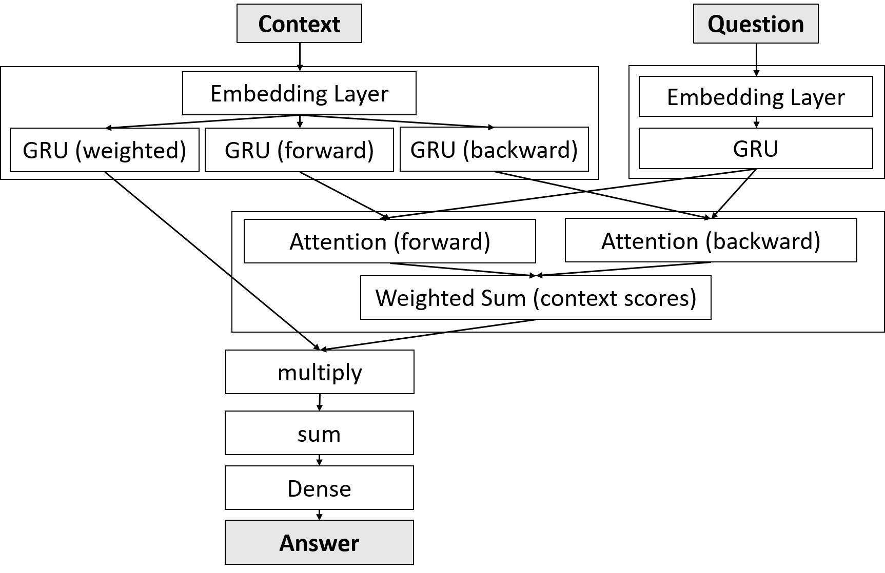

# Question Answering model

Tran Le, Stella (Seoyeon) Lee
Grinnell College CSC 395 Information Retrieval

This repository contains the implementation of question-answering model which primary goals to understand sequential context. 

## Github repository structure

### script

This folder contains `fetch_glove.sh` and `get_bAbi.sh` which is used to download `GloVe` pre-trained word embeddings and Facebook bAbi dataset.

### src

1. **preprocessing** contains python files to preprocess bAbi dataset
2. **baseline_model** contains python files to train/test lstm models
3. **model** contains python files of custom keras layers and models
4. **train.py** is a python file used for training our custom QA models

---

### preprocessing

1. `get_glove.py` contains functions to load `GloVe` embeddings and embedding matrix
   - `load_vectors(filepath)`: Load `GloVe` text file to dictionary of `{word:embedding}`
   - `load_embedding_matrix(data_folder, dims)`: Load embedding vectors to an embedding matrix and create word-index mapping
2. `process_bAbi.py` contains functions to save each of tasks into Context, Question, and Answer 
3. `preprocessing.py`
   - `transform(input, max_len, tokenizer)` : Returns padded sequence that is transformed from `input` by `tokenizer.texts_to_sequences`
   - `main(dim, embedding_folder, data_folder)` saves the embedding matrix and tokenizer

### baseline_model

1. `lstm_train.py` and `lstm_test.py` is implementation for LSTM model 
2. `lstm_glove_train.py` and `lstm_glove_test.py` is implementation for LSTM model using GloVe pre-trained word embeddings

## model

1. `AttentionModel` contains our QA Attention, Attention+Mem models implementation
   - `model2.py` contains
     - `AttentionModel2`
     {:height="50%" width="50%"}
     - `AttentionModel3`
     {:height="50%" width="50%"}
     
2. `InputLayer.py` contains `PretrainedEmbedding(Layer)` that is used for our custom models used for GloVe embedding layers
